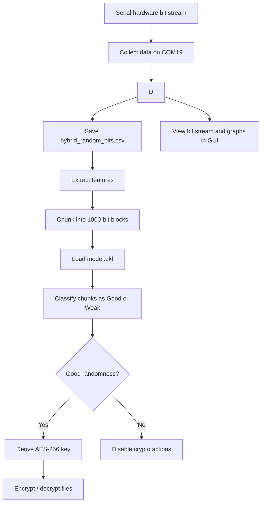

# Quantum Tunneling RNG + ML Crypto Framework

This project combines hardware-generated entropy, machine-learning based randomness classification, and AES-256-GCM file encryption into a single desktop application. The workflow is built around a hybrid bit stream produced from a serial hardware source, then analyzed with a trained model before being used as a key source for encryption.

## Overview

The repository contains four main parts:

1. Data collection from a serial hardware source.
2. Feature extraction and dataset generation for machine learning.
3. Model training and hardware-stream analysis.
4. A Tkinter desktop GUI for collection, visualisation, analysis, and encryption/decryption.

## Workflow Diagram



The current implementation uses a fixed feature schema for model input:

- entropy
- mean
- variance
- autocorr
- run_length

That order is important throughout the project. The classifier expects those features in that exact sequence.

## Features

- Collects bits from a serial device on COM19 at 115200 baud.

- Extracts statistical randomness features from bit chunks.
- Builds a synthetic training dataset for weak vs good randomness classification.
- Trains a RandomForestClassifier and saves it as model.pkl.
- Analyzes new bit streams by classifying 1000-bit chunks.
- Displays entropy, mean, variance, autocorrelation, and run length in the GUI.
- Shows live and expanded visualisations of bit distribution, transition probabilities, and bit stream patterns.
- Generates an AES-256 key from the collected bits when the randomness verdict is good.
- Encrypts and decrypts files with AES-256-GCM.
- Lets the user copy, save, and load keys from disk.

## Repository Structure

| File | Purpose |
| --- | --- |
| build_dataset.py | Generates a labeled dataset of weak and good random bit samples and writes dataset.csv. |
| collect_data.py | Reads bits from the serial device, mixes them with secrets.randbits(1), and writes hybrid_random_bits.csv. |
| crypto_engine.py | AES-256-GCM key derivation, file encryption, file decryption, and key save/load helpers. |
| dataset.csv | Generated training dataset with feature columns plus label. |
| features.py | Feature extraction logic used by both training and inference. |
| gui.py | Tkinter desktop application for collection, analysis, visualisation, and crypto actions. |
| hybrid_random_bits.csv | Generated bit stream used by the GUI and hardware processing scripts. |
| model.pkl | Trained RandomForest model saved with joblib. |
| process_hardware.py | Loads hybrid_random_bits.csv, extracts chunk features, and predicts randomness quality. |
| test_hardware.py | Minimal example that loads model.pkl and predicts a sample bit stream. |
| train_model.py | Trains the classifier from dataset.csv and saves model.pkl. |

## How the Pipeline Works

### 1. Feature extraction

The core feature extractor is in features.py. It converts a bit sequence into the following metrics:

- Shannon entropy
- Mean bit value
- Variance
- Lag-1 autocorrelation
- Average run length

These values are returned as a list in the exact order shown above.

### 2. Dataset creation

build_dataset.py creates a synthetic dataset with two classes:

- Weak: generated with a biased bit pattern using random.choice([0, 1, 1])
- Good: generated with uniformly random bits using random.randint(0, 1)

Each sample is 1000 bits long and is converted into the five features before being labeled. The script writes the result to dataset.csv.

### 3. Model training

train_model.py loads dataset.csv, splits the data into train and test sets, trains a RandomForestClassifier, prints the test accuracy, and saves the trained model to model.pkl.

### 4. Hardware / hybrid bit collection

collect_data.py opens COM19 at 115200 baud, discards the first 50 lines as startup noise, then reads 0/1 values from the serial port. The collected hardware bits are saved to hybrid_random_bits.csv.

### 5. Hardware stream analysis

process_hardware.py reads hybrid_random_bits.csv, chunks the stream into blocks of 1000 bits, extracts features for each chunk, loads model.pkl, aligns the feature columns using the model’s stored feature_names_in_ when available, and prints a final summary based on the chunk predictions.

### 6. GUI workflow

gui.py provides a desktop dashboard with these actions:

- Collect Data: attempts live serial collection first; if that fails, falls back to hybrid_random_bits.csv.
- Run Analysis: chunks the bit stream, computes features, and classifies each chunk.
- View Random Bits: opens a viewer for the saved bit stream.
- Secure Encryption Module: enables AES-256-GCM encryption/decryption after a good randomness verdict.

When the analysis result is better than weak, the GUI derives an AES key from the collected bits and enables the encryption controls.

## Requirements

The project uses Python and the following packages:

- pandas
- numpy
- scikit-learn
- joblib
- cryptography
- pyserial
- matplotlib

The GUI also uses the standard library modules tkinter, threading, os, time, math, and secrets.

## Setup

1. Create and activate a Python virtual environment.
2. Install the required packages.
3. Make sure your hardware device is connected and accessible on COM19 if you want live collection.
4. Confirm that model.pkl exists, or retrain it using train_model.py.

Example package installation:

```bash
pip install pandas numpy scikit-learn joblib cryptography pyserial matplotlib
```

## Running the Project

### Train the model

```bash
python build_dataset.py
python train_model.py
```

This creates or refreshes dataset.csv and model.pkl.

### Collect hybrid random bits

```bash
python collect_data.py
```

This writes hybrid_random_bits.csv from live serial input.

### Analyze the collected hardware bits

```bash
python process_hardware.py
```

This prints chunk-by-chunk model predictions and an overall randomness verdict.

### Launch the desktop app

```bash
python gui.py
```

The GUI is the main user-facing entry point. It can collect bits, visualize them, run the model, and manage file encryption.

### Test the trained model with a sample stream

```bash
python test_hardware.py
```

This is a lightweight inference example using a repeated bit pattern.

## Output Files

The main generated artifacts are:

- dataset.csv: labeled feature dataset used for training.
- hybrid_random_bits.csv: collected hybrid bit stream.
- model.pkl: saved trained classifier.
- .enc files: AES-GCM encrypted outputs produced by the GUI or crypto helpers.
- .key or .txt key files: saved AES key material in hex form.

## Crypto Details

The encryption engine in crypto_engine.py uses AES-256-GCM.

- bits_to_key() packs the collected bits into bytes and hashes them with SHA-256 to produce a 32-byte key.
- encrypt_file() writes nonce + ciphertext to a new .enc file.
- decrypt_file() restores the original file name when possible, or appends _decrypted if needed.
- save_key_to_file() and load_key_from_file() store and restore keys as hexadecimal text.

## Important Notes

- The model input schema must stay in the order entropy, mean, variance, autocorr, run_length.
- process_hardware.py and gui.py both guard against feature-order mismatches by using the trained model’s feature_names_in_ when available.
- collect_data.py currently targets COM19. If your serial device uses a different port, update the script before running live collection.
- The GUI can still function with the fallback CSV if live serial collection is unavailable.
- Encryption is intentionally gated by the randomness verdict. If the model predicts weak randomness, key generation and encryption are disabled.

## Suggested Usage Flow

1. Generate the dataset with build_dataset.py.
2. Train the model with train_model.py.
3. Collect or load hybrid_random_bits.csv.
4. Run the GUI with gui.py.
5. Collect data, run analysis, and inspect the verdict.
6. If the result is good, use the generated AES key to encrypt or decrypt files.

## Project Summary

This repository is a compact end-to-end demo of hardware entropy collection, statistical randomness evaluation, supervised classification, and secure file encryption. The GUI ties the pieces together and gives a single place to inspect the bit stream, the extracted features, the classification result, and the encryption state.